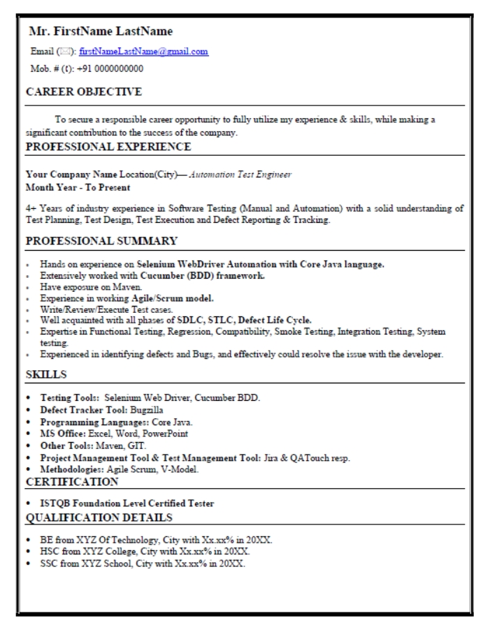
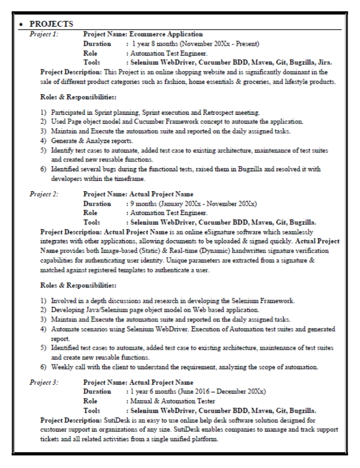
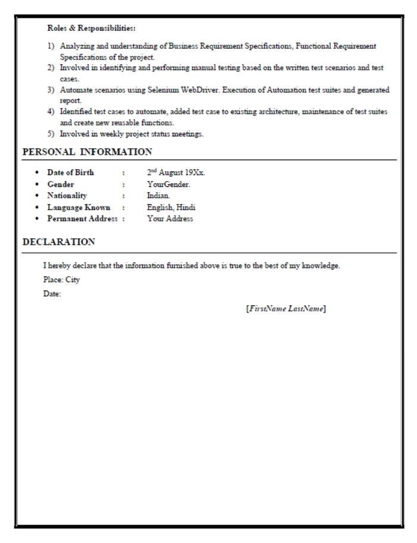

# tutorial-resume-prep-and-profile

---

#### Details: 
* Created By: <b>Sarang Holey</b>
* Date: February-2021
* This Repo contain step by step guide for Resume & Online profile creation. 
* You can use the provided material for your Resume & Online profile creation.
* Reach out for more details about this repo: akashdktyagi@gmail.com / sarangholey@gmail.com

# Resume Preparation

---

Pointers To Be Considered

### Tools, Technology & Project
* You should know all the words and its meaning written in the resume.
* Just for sake of writing and making the resume more fancy & appealing don't mention the tools and technologies that you are unaware of.
* It's not necessary to mention 2 or 3 projects. One project is also enough. But you did mention 2 projects also fine.
* You should know about your project (Application) really well with all the different modules available in it.
* Try to mention the technical skills on the first page of the resume.

### Formatting & General Mentioning
* Resume should be of 2 - 3 pages not more than that.
* Choose some decent font which will be easy to read.
* Don't attach your photograph in your resume until it is asked by the recruiter.
* No need for writing the end declaration of the resume
* Mentioning your job location is enough if there is left out space at the end of page then you can mention the personal details. (Ex. Father full name, Address, etc)
* While sharing the resume it should be in PDF format only.
* The name of the resume should be FirstName_LastName_+XYearsExp_ProfileName.pdf
Profile Name - Ex. Automation Tester, QA_Engg, TestEngineer
* No need of adding up a separate column for your education, College/University,
And respective percentages. Can just mention the branch of UG or UG & PG both with years of passing & university in one or two lines.

 
Click here-Sample Resume

 
  >
  >
  >

---

# About Naukri Profile

---

* Upload the profile passport photo in decent attire
* Complete your naukri profile at 100%
* Create a formal emailID specially for the Naukri Profile
* Don’t connect or add any social media accounts to it
* Make use of all the related keyword in “Key Skills” section
* Add job type as permanent 
* Resume Headline should be catchy enough to tell about you in 2 3 lines.
* Don't forget to mention the top 5 key skills under “Employment” section
* If you have any older profiles active for Naukri, Indeed, Monster, Linkedin etc.
deactivate it immediately.
* Do update your profile on a daily basis in the morning regardless if it's a weekend or any National Holiday.
---

